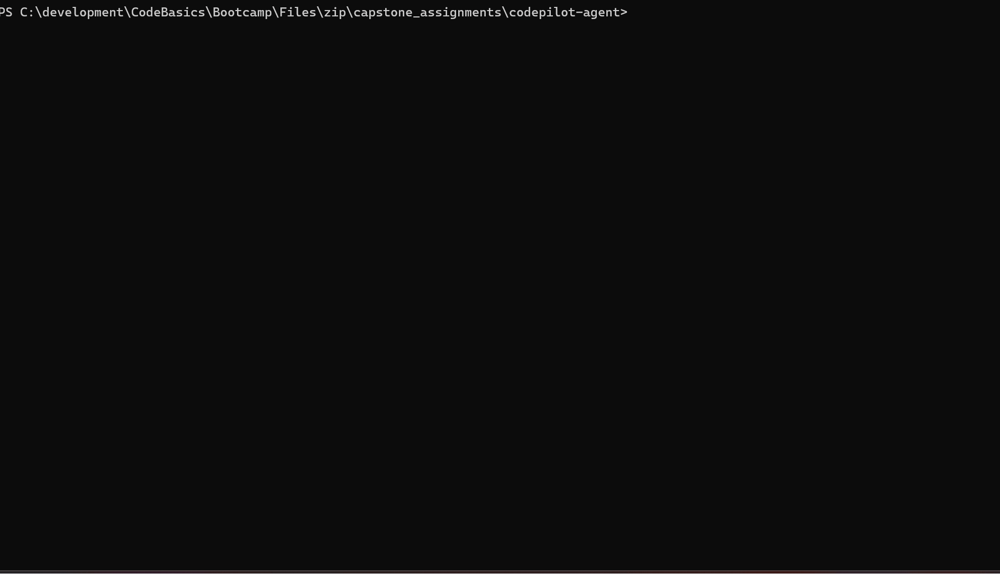
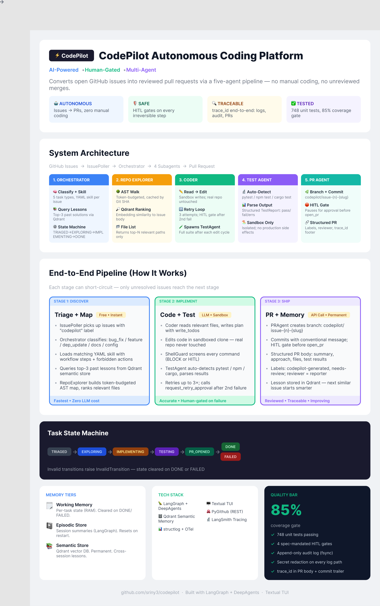

# CodePilot

**Multi-agent autonomous coding platform.** Polls GitHub issues, classifies them, plans the fix in a sandboxed clone of the target repository, runs tests, and opens a structured pull request — all driven from a four-panel terminal dashboard with human-in-the-loop approval gates on irreversible operations.

Built on [DeepAgents](https://github.com/langchain-ai/deepagents) (LangGraph), [Textual](https://textual.textualize.io/), and PyGithub.

> Status:  Production-grade observability and guardrails; single-machine concurrency. Not yet hardened for multi-tenant deployment.

---

## Demo

### TUI in action



*Four-panel dashboard: issues feed (top-left), active task + state machine (top-right), live activity log (middle), HITL approval gate (bottom — appears on irreversible operations).*

> **To record your own:** `python -m codepilot run` → point at a test repo with open issues → `ffmpeg -f gdigrab -i desktop output.gif` or use OBS/Gifski.

### Example generated PR

**Issue:** `Fix eslint error in page.tsx (setState in effect hook)`

**PR opened by CodePilot:** [codepilot/issue-5-fix-eslint-setstate-in-effect · financebot#12](https://github.com/sriny3/financebot/pull/12)

```
Branch:  codepilot/issue-5-fix-eslint-setstate-in-effect
Commit:  fix: wrap setState calls inside useEffect cleanup function (#5)
Labels:  codepilot-generated, needs-review
Trace:   a3f2c1d8-...
```

PR body contains: issue link, approach summary, test results, and `Trace-Id:` footer for full replay via `python -m codepilot.observability.trace_cli <trace_id>`.

---

## Table of contents

- [What it does](#what-it-does)
- [Architecture](#architecture)
- [Quick start](#quick-start)
- [Configuration](#configuration)
- [Daily commands](#daily-commands)
- [Human-in-the-loop gates](#human-in-the-loop-gates)
- [Project layout](#project-layout)
- [Observability](#observability)
- [Troubleshooting](#troubleshooting)
- [Known limitations](#known-limitations)
- [License](#license)

---

## What it does

For every open GitHub issue matching the configured filter, CodePilot:

1. **Classifies** the task (`bug_fix`, `feature_addition`, `dependency_update`, `documentation`, `config_change`) and selects a matching skill.
2. **Maps the repository** with a token-budgeted AST walk and ranks files by keyword + embedding similarity to the issue body.
3. **Edits the code** in a sandboxed clone of the target repo through a plan-edit-test loop with retries.
4. **Runs the test suite** (auto-detects `pytest`, `npm test`, `cargo test`).
5. **Opens a pull request** with structured commit message, PR body, labels, and reviewer — pausing for human approval before any irreversible GitHub operation.
6. **Records the lesson** in semantic memory for retrieval on future similar tasks.

Every step streams into a live four-panel TUI; every irreversible action is gated behind keyboard approval.

---

## Architecture



*Full-resolution infographic: [Figma file](https://www.figma.com/design/c8lHLooVewJLcRDGBKfNLo)*

```
┌──────────────────────────────────────────────────────────┐
│                    Textual TUI (3-row grid)              │
│  ┌──────────────────────┬─────────────────────────────┐  │
│  │ Issues               │ Active Task                 │  │
│  │ (live polled feed)   │ (state, agent, retry, ♥)    │  │
│  ├──────────────────────┴─────────────────────────────┤  │
│  │ Activity Log (full-width, color-coded by severity) │  │
│  ├────────────────────────────────────────────────────┤  │
│  │ Approval Panel (hidden until HITL fires)           │  │
│  └────────────────────────────────────────────────────┘  │
└──────────────────────────┬───────────────────────────────┘
                           │
                           ▼
              ┌────────────────────────┐
              │   Orchestrator (deep)  │  classify → plan → dispatch
              │   write_todos loop     │  state machine per task
              │   memory injection     │  episodic + semantic recall
              └────────┬───────────────┘
        ┌─────────────┼──────────────────────────┐
        ▼             ▼                          ▼
┌──────────────┐ ┌──────────────┐       ┌──────────────────┐
│ RepoExplorer │ │    Coder     │       │     PRAgent      │
│  ─────────── │ │ ──────────── │       │ ──────────────── │
│ AST walk     │ │ read_file    │       │ create_branch    │
│ token budget │ │ write_todos  │       │ commit_files     │
│ Qdrant +     │ │ edit_file    │       │ open_pr          │
│ TF-IDF rank  │ │ run sandbox  │       │ HITL gates       │
└──────────────┘ └──────┬───────┘       └──────────────────┘
                        │
                        ▼
                 ┌─────────────┐
                 │  TestAgent  │   pytest|npm|cargo detection
                 │  ─────────  │   sandbox execution
                 │  parser     │   structured TestReport
                 └─────────────┘

Cross-cutting: structlog JSON logs · OpenTelemetry spans · Append-only audit log
              · Secret redaction middleware · LangSmith LLM tracing (optional)
              · trace_id propagated through every agent via contextvars
```

State machine: `TRIAGED → EXPLORING → IMPLEMENTING → TESTING → PR_OPENED → DONE | FAILED`. Invalid transitions raise `InvalidTransition`; state is cleared on terminal states.

---

## Quick start

### Prerequisites

- Python ≥ 3.11
- A GitHub repository to operate on (the *target* — distinct from this repo)
- A GitHub Personal Access Token *or* a GitHub App with repo + PR write permissions
- One LLM API key: OpenAI **or** Anthropic **or** Groq
- (Optional) A Qdrant instance for semantic memory — falls back to keyword retrieval if absent

### Install

```bash
git clone https://github.com/sriny3/codepilot.git
cd codepilot
python -m venv .venv

# macOS / Linux
source .venv/bin/activate
# Windows
.venv\Scripts\activate

pip install -e ".[dev]"
```

### Configure

```bash
cp .env.example .env
```

Edit `.env`. Minimum required values:

```bash
GITHUB_TOKEN=ghp_...                # PAT for the target repo
GITHUB_APP_ID=123456                # validator-required, even with token auth
REPO_FULL_NAME=org/target-repo      # the repo CodePilot will operate on
ANTHROPIC_API_KEY=sk-ant-...        # or OPENAI_API_KEY / GROQ_API_KEY
```

### Verify and run

```bash
python -m codepilot doctor          # validate environment
python -m codepilot run             # launch TUI
```

Windows users without `make` use `python tasks.py <task>` — same target names as the Make targets below.

---

## Configuration

Configuration is loaded once via [pydantic-settings](https://docs.pydantic.dev/latest/concepts/pydantic_settings/) from `.env`. The settings object is `lru_cached`; after monkey-patching environment variables in tests, call `get_settings.cache_clear()`.

| Variable | Required | Default | Purpose |
|---|---|---|---|
| `GITHUB_TOKEN` | one of | — | Personal access token (preferred for development) |
| `GITHUB_APP_ID` | yes | — | Required by `GitHubAPIWrapper` validator even with token auth |
| `GITHUB_APP_PRIVATE_KEY` | one of | dummy | Required for App auth; stub auto-set when token is present |
| `REPO_FULL_NAME` | yes | — | Target repository as `owner/name` |
| `ANTHROPIC_API_KEY` | one of | — | Anthropic LLM key |
| `OPENAI_API_KEY` | one of | — | OpenAI LLM + embedding key |
| `GROQ_API_KEY` | one of | — | Groq LLM key (alternative) |
| `POLL_INTERVAL_MIN` | no | `5` | Minutes between issue polls |
| `MAX_RETRIES` | no | `3` | Coder retry budget before HITL prompt |
| `TOKEN_BUDGET_REPOMAP` | no | `4000` | Max tokens for the repo-map prompt |
| `MAX_INFLIGHT_TASKS` | no | `2` | Concurrent tasks the orchestrator will run |
| `QDRANT_URL` | no | `http://localhost:6333` | Semantic memory backend |
| `QDRANT_API_KEY` | no | — | For Qdrant Cloud |
| `LOG_LEVEL` | no | `INFO` | `DEBUG` / `INFO` / `WARNING` / `ERROR` |
| `LOG_DIR` | no | `./logs` | Directory for JSONL + audit logs |
| `LOG_FORMAT` | no | `json` | `json` (production) or `console` (dev) |
| `OTEL_EXPORTER_OTLP_ENDPOINT` | no | — | e.g. `http://localhost:4317` for Jaeger |
| `LANGSMITH_API_KEY` | no | — | Activates LangSmith LLM call tracing |
| `LANGSMITH_PROJECT` | no | `codepilot` | LangSmith project name |

`.env.example` ships with placeholder values only. Real secrets must never be committed — `.gitignore` blocks `.env`, `*.pem`, `*.key`, `*credentials*`, and `*.private-key*`.

---

## Daily commands

```
python tasks.py install-dev    pip install -e .[dev]
python tasks.py test           pytest
python tasks.py test-unit      pytest tests/unit
python tasks.py test-cov       pytest with coverage report (85% gate)
python tasks.py lint           ruff check
python tasks.py format         ruff format
python tasks.py type           mypy
python tasks.py doctor         validate .env
python tasks.py run            launch TUI
```

`make <target>` works identically on Unix.

### Keybindings (TUI)

| Key | Action |
|---|---|
| `i` | Open the new-task modal (free-form prompt — bypasses issue polling) |
| `l` | Toggle the activity log panel |
| `s` | Skip the current issue (placeholder; not yet wired) |
| `q` | Quit |

Approval prompts accept `a` / `approve` / `y` / `yes` and `r` / `reject` / `n` / `no`.

---

## Human-in-the-loop gates

Following the assignment specification, HITL approval is required only for irreversible or scope-broadening operations:

| Operation | Trigger condition |
|---|---|
| `open_pr` | PR target branch is `main` or `master` |
| `commit_files` | Commit touches more than 5 files |
| `execute` containing `git push` | Always (blocked by shell guardrail; not approvable) |
| `request_retry_approval` | Coder must call before any retry beyond the second consecutive failure |

Approval is gated at the **tool level** (in `codepilot/agents/tools/github_tools.py`), not via DeepAgents `interrupt_on`. This is deliberate: subagent interrupts do not propagate through the `task` tool boundary in DeepAgents, so a per-tool gate is the only reliable mechanism. The gate blocks the orchestrator thread on a `threading.Event` while the TUI thread renders the approval panel.

The approval panel displays the operation summary, branch name, commit message, file count, labels, reviewers, and a GitHub compare URL so the reviewer can inspect the diff before approving.

---

## Project layout

```
codepilot/
├── orchestrator/      root deep-agent + state machine + classifier
├── agents/
│   ├── repo_explorer/ AST walker, summarizer, retrieval
│   ├── coder/         edit application logic
│   ├── test_agent/    runner + parser
│   ├── pr_agent/      branch + commit + PR builder
│   ├── tools/         LangChain @tool wrappers (GitHub, repo, test ops)
│   └── subagents.py   DeepAgents SubAgent specs
├── skills/            YAML skill definitions + registry
├── memory/            working (state machine), episodic, semantic (Qdrant)
├── guardrails/        shell, file, prompt, HITL guards
├── observability/     structlog, OTel, audit log, LangSmith, redaction
├── sandbox/           local sandbox + diff generation
├── github_io/         poller, client, models, filters, workspace cleanup
├── tui/               Textual app (3-row grid)
└── config/            pydantic-settings

tests/
├── unit/              fast pure-Python tests
├── integration/       opt-in via `pytest -m integration`
├── e2e/               opt-in via `E2E=1` env var (live GitHub repo required)
└── tui/               textual snapshot + keybinding tests

docs/
├── steering/          per-phase design docs (phase_06 … phase_11)
├── learning-guide.md  end-to-end walkthrough
└── superpowers/       brainstorm specs and implementation plans
```

---

## Observability

Every agent invocation is wrapped in a context manager that mints a `trace_id` (and per-span `span_id`) propagated through `contextvars`:

- **Structured logs** — `structlog` JSON, daily-rotated, 30-day retention. Console format available for dev (`LOG_FORMAT=console`).
- **Audit log** — append-only JSONL with per-write `fsync`, schema-validated against `AUDIT_ENVELOPE_SCHEMA`. Captures every PR creation, HITL decision, guardrail block, and state transition.
- **Secret redaction** — middleware strips token/key/auth patterns before any write.
- **OpenTelemetry** — spans exported via OTLP when `OTEL_EXPORTER_OTLP_ENDPOINT` is set (Jaeger, Tempo, etc.).
- **LangSmith** — every LLM call traced when `LANGSMITH_API_KEY` is set.
- **Trace replay** — `python -m codepilot.observability.trace_cli <trace_id>` reconstructs the full task timeline from the JSONL log.

The `trace_id` also appears in PR body footers (`Trace-Id: ...`) and commit message trailers, so a merged PR can be traced back to the originating run.

---

## Troubleshooting

**`config error: ...` from `doctor`**
`python -m codepilot doctor` validates every required setting and prints which one is missing or malformed. The most common cause is a missing `GITHUB_APP_ID` (the `GitHubAPIWrapper` validator demands it even when `GITHUB_TOKEN` is the active credential — a dummy private key is auto-injected for the same reason).

**Approval panel never appears**
Confirm the gate fired by checking `logs/tool-trace.log` for `[TOOL-CALL] commit_files(...)` or `[TOOL-CALL] open_pr(...)`. If those entries exist but the panel did not render, the TUI thread is likely blocked — quit with `q` and check stderr for `[HITL-GATE]` messages.

**`IndexError: list index out of range` from `create_branch`**
Indicates the `langchain_community` `GitHubAPIWrapper` choking on PyGithub responses. CodePilot uses PyGithub directly via `_get_repo()` — if you see this error, you are on an outdated build; pull `master`.

**LLM hallucinates a credential request**
Earlier versions of pr_agent sometimes invented "missing Git context" errors when tools failed. Current pr_agent prompt forbids speculation: any tool error is reported verbatim with status `FAILED`. If you still see hallucinations, check the prompt has not regressed.

**Workspace not cleaned up after a crash**
The orchestrator clones the target repo to `.codepilot/workspace/<repo_name>/` and deletes it on terminal state. A crash can leave the directory behind — safe to delete manually.

---

## Known limitations

- **Single-machine only.** No distributed task queue; `MAX_INFLIGHT_TASKS` caps concurrency within one process.
- **No auto-merge.** PR Agent opens the PR for human review — merging is intentionally left to the human, per the assignment spec.
- **Subagent interrupts don't bubble.** The DeepAgents `task` tool runs subagents synchronously; LangGraph `interrupt()` calls inside a subagent do not surface in the parent stream. HITL is implemented at the tool level instead.
- **TUI captures stderr.** Diagnostic prints from background threads land in `logs/tool-trace.log` rather than the visible terminal.

---

## License

MIT
